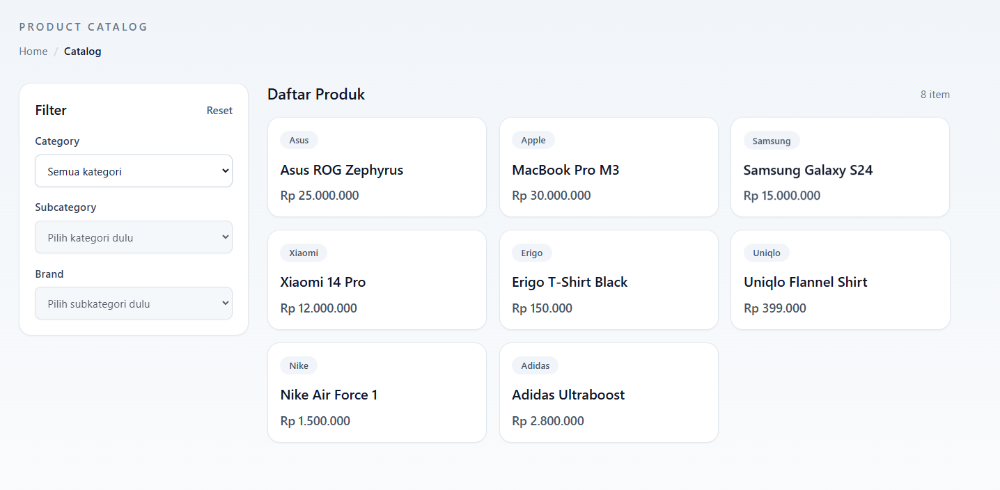
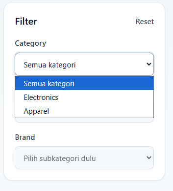
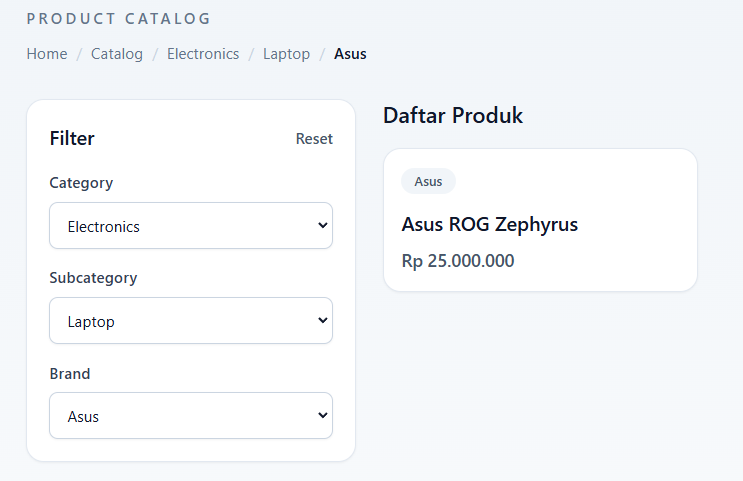

# Product Catalog — RevoU Code Challenge

## Live Demo
Live Demo:https://code-chall-revou.vercel.app/

## Tech Stack
- React 18 + Vite
- React Router DOM v6 (Data API: createBrowserRouter, loader)
- Tailwind CSS v3

## Features
- Cascading dropdown filters (Category > Sub-Category > Brand)
- URL-based state persistence (filter tidak hilang saat refresh)
- Reset filter button
- Dynamic breadcrumb navigation
- Responsive product grid

## How to Run
```bash
npm install
npm run dev
```

## Screenshots
### Initial State


### Cascading Filter in Action


### URL State Persistence


## Problem Solving Approach
State filter disimpan di URL menggunakan useSearchParams() dari React
Router DOM, bukan useState. Ini memastikan filter tidak hilang saat
browser di-refresh karena URL tetap sama.

Data di-load menggunakan loader function dari React Router Data API,
sehingga data tersedia sebelum komponen dirender.
